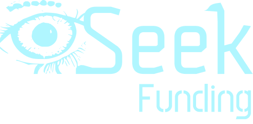

Working repository for https://github.com/Eyeseek-org/funding, needed to fall back from some ideas like PWA and Next v13 to achieve stable deployment.

<div>
  <div align="center">
    <h1 style="font-weight: bold">Eyeseek Funding</h1>
    
    <br />
    <br />
    <p align="center">
    This repository was created as a Moralis hackathon project for cross-chain crowdfunding application. This project is derived from <a href="https://www.eyeseek.org/Whitepaper_v1.pdf">Eyeseek.org whitepaper</a>.  
    </p>
    <br />
    <a href="https://github.com/helloitsm3/tiktok-android/issues">Report Bugs</a>
    ·
    <a href="https://github.com/helloitsm3/tiktok-android/issues">Request Feature</a>
    ·
    <a href="https://www.fund.eyeseek.org">Project Website</a>
    </div>
</div>

## Table of Contents

- [Table of Contents](#table-of-contents)
- [Built-with](#built-with)
- [Getting Started](#getting-started)

<br />

## Built-with

- [Next.js](https://nextjs.org/)
- [Wagmi](https://wagmi.sh/)
- [Styled Components](https://styled-components.com/)

<br />

<!-- GETTING STARTED -->

## Getting Started

This is an example of how you can set up your project locally. To get a local copy up and running follow these simple example steps.

1. Fork the repo

2. Clone the repo

```sh
git clone with HTTPS          https://github.com/YOUR_USERNAME/funding.git
git clone with SSH            git@github.com:YOUR_USERNAME/funding.git
git clone with Github CLI     gh repo clone YOUR_USERNAME/funding
```

3. Development

```sh
1. Open the project in VS Code
2. yarn install
3. yarn dev
```

4. PR via separate branch

```sh
git checkout -b feature/AmazingFeature
git add .
git commit -m "Add some AmazingFeature"
git push origin feature/AmazingFeature
```

- PR is reviewed then by the core team and merge/rejected based on the quality of the code.
